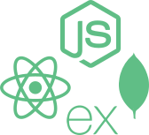
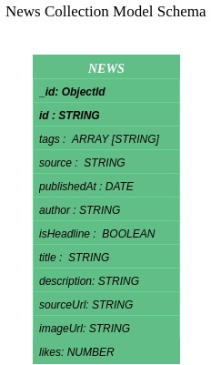
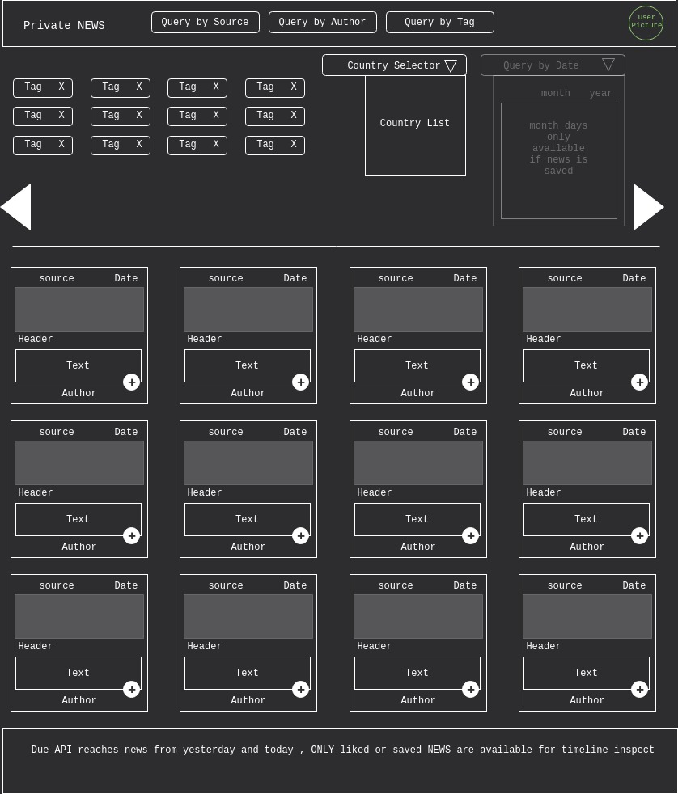
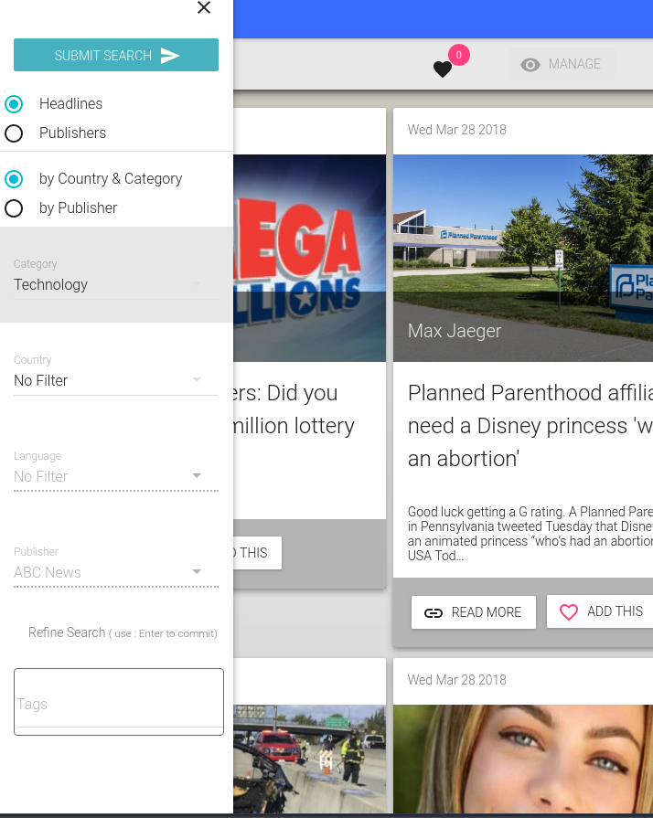
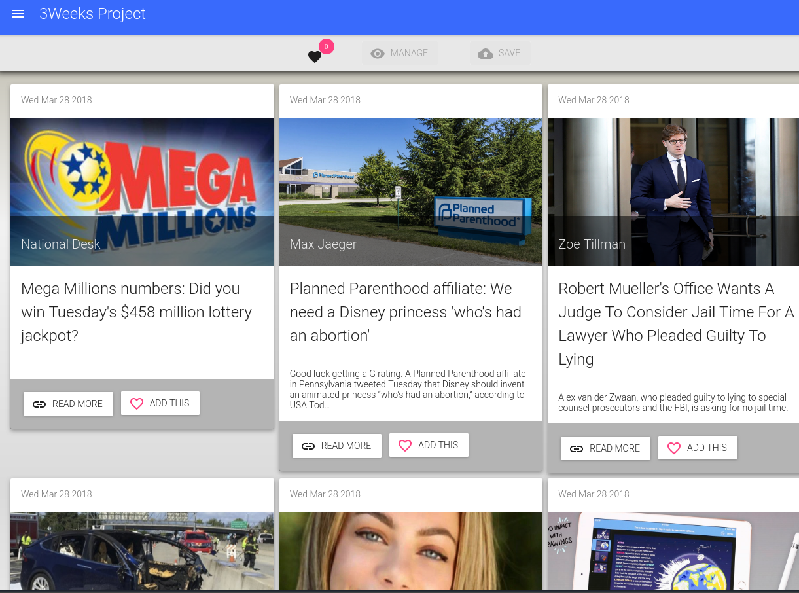
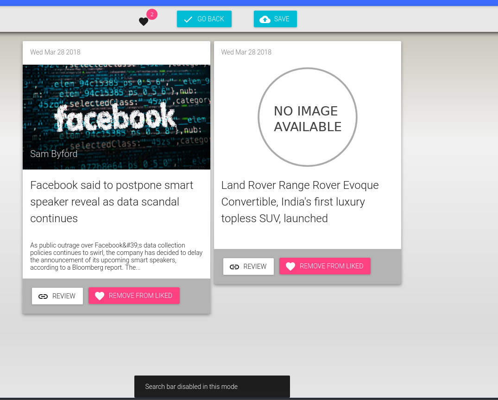
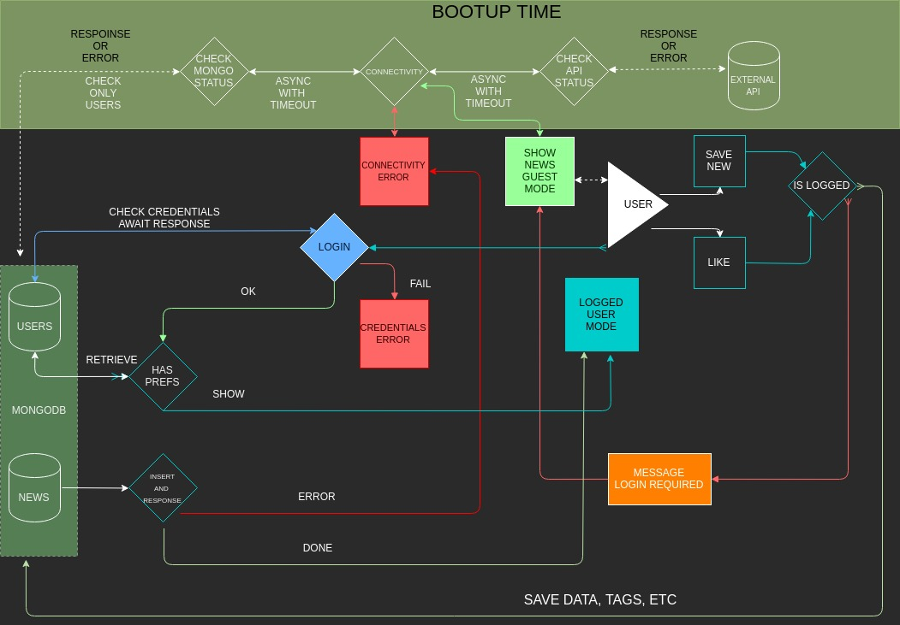

## *3 Weeks Project* 

#### *( an Skylab Academy bootcamp project )*




#### *BRIEF*

*Bootcamp 3 weeks project using `react`, `nodejs` , `express` , `mongo` as technologies, agile as methodology.*
 
 *This Project show news from different sources( newspapers, tv news ) ordered by date , country, tag/term , ... fetching from remote API server and storing the 'liked' results to _`MONGO`_ DB as cache server to further reading. I think it's a interesting way to show the same world event from different sources at time , see the evolution of facts , the most liked notices, or even statistical purpouses. This is a private training webapp.*

---
#### *PROJECT TIMING*

``` sh

WEEK
    Evaluate all the specs
 1|-----------------
  | Client Design + Code + Testing
  | 
  | 
  |
  |Friday Checkpoint
 2|-----------------
  | Server Design + Code + Testing
  |
  |
  |
  |Friday Checkpoint
 3|------------------
  | Refactor
  | Integration + testing
  |
  |
  | End Project
```
---
#### *DASHBOARD BACKLOG*

*[Trello Dashboard](https://trello.com/b/yqpM20us/3-weeks-project)*

---
#### *MODEL ( Data )*

*To do this, I choose the following draft concept data models*

*Server side api data storage*




---
### *FUNC ( VIEWS, MOCKS )*

*First mockup*



*Result*

*Headlines Query*



*Sources Query*


*Detail on liked hedlines management


---
### *DESIGN ( Architecture (UML) )*

#### *FLOW*





#### *TODO*


- [ ] *include api-server test*

- [ ] *improve login feature in client-app*
