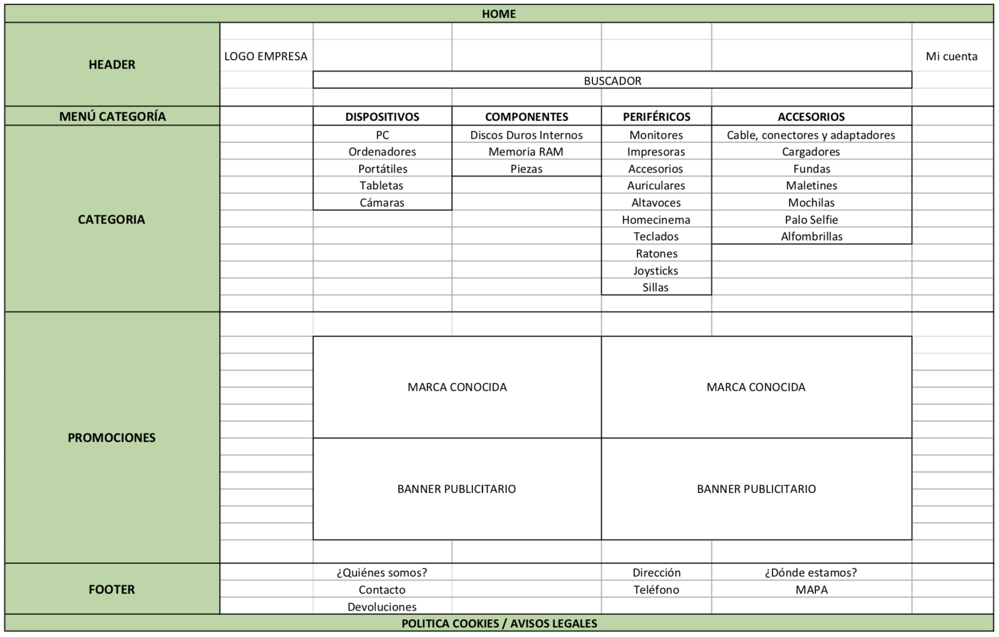
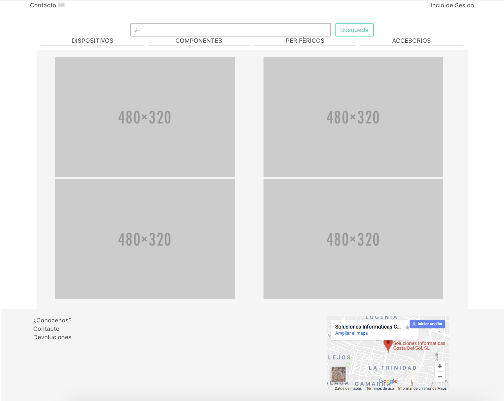
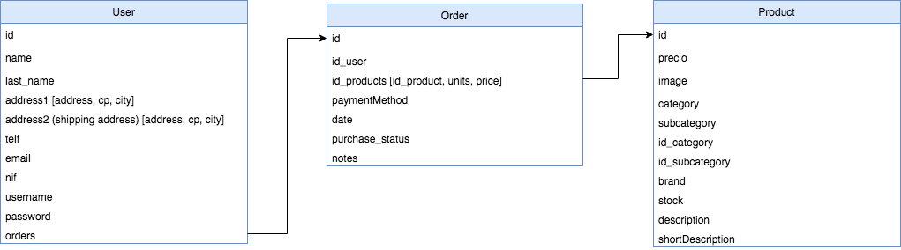

# INFORCOSTA.COM


## OBJETIVO

Creacion de una pagina web e-commerce para una tienda de productos y consumibles informaticos. En este proyecto de creara una parte de Frontend y de Banckend para gestionar productos, pedidos y clientes.
<br>


### METODOLOGIAS DE TRABAJO

- KANBAN (<a href="https://trello.com/b/qjSDJ8yw/inforcostacom">TRELLO</a>)

- GITHUB

### TECNOLOGIAS

- CSS FRAMEWORK: BULMA
- JAVASCRIPT
- REACTJS
- REACT ROUTER
- NODEJS
- MONGO (DATABASE)
- MOCHA (TDD)


### COMPONENTES

``` bh
APP
├── HOME
│   ├── BUSQUEDA DE PRODUCTOS
│   ├── FAMILIA DE PRODUCTOS
│   └── PRODUCTOS PROMOCIONADOS
│
├─── FAMILA DE PRODUCTOS
│            └── CATAGORIA DE PRODUCTOS
│                          ├─── FILTROS
│                          └─── PRODUCTOS
│                                   └── FICHA DE PRODUCTO
├─── CARRITO 
│ 
└─── CONTACTO / DEVOLUCIONES

```


# DISEÑO


## MOCKUP

+ **Pagina de inicio**



+ **Pagina de SubCategorias**


+ **Pagina de Productos segun SubCatetogria**


+ **Pagina de Ficha de Productos**


## HTML Y CSS

+ **Pagina de inicio**



+ **Pagina de SubCategorias**


+ **Pagina de Productos segun SubCatetogria**


+ **Pagina de Ficha de Productos**


# MODELO DE DATOS




### PROGRAMADOR WEB

- <a href="https://github.com/JaimeRC">Jaime Rubio</a>


{
    "_id": {
        "$oid": "5ab26a8c0924684b16496c72"
    },
    "name": "Jaime",
    "surname": "Rubio",
    "address1": "Calle Marmoles",
    "address2": "Calle Bermudes",
    "telf": 123456789,
    "email": "jaime.rc@icloud.com",
    "nif": "987654321",
    "username": "JaimeRC",
    "password": "123",
    "__v": 0
}